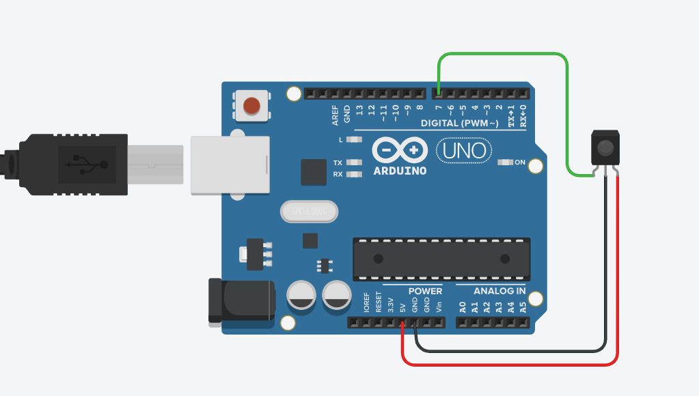
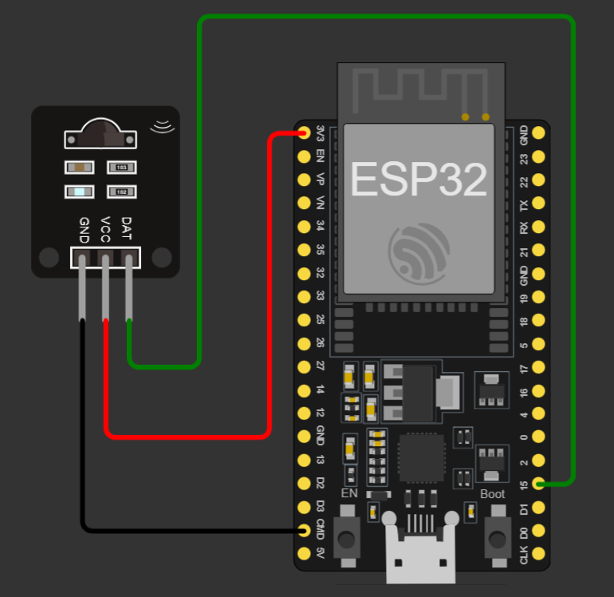

# SumoIR
 Easily activate your sumo robot using this library and an infrared sensor. Prepare, Start and Stop.

## Dependencies
 - IRremote (https://github.com/Arduino-IRremote/Arduino-IRremote)

## Montagem

A montagem é bem simples, só precisa de um sensor infravermelho de 38kHz ou 40kHz e alguns componentes auxiliares.


| ARDUINO  | ESP32    |
|----------|:---------|
|  |  |


Também podemos adicionar um led de status. Também é possivel usar o led on board como LED de status.

## Como usar

basta inicia a biblioteca com o pino que o sensor esta conectado. No loop adicione o metodo de update para monitorar o recebimento de comandos.

```c++

#include "SumoIR.h"

SumoIR IR;

void setup(){
  IR.begin(15); // sensor conectado no pino 15
}

void loop() {
    IR.update();
    if ( IR.on() ) {
      
      /* codigo do robô ligado */

    }else{

      /* codigo do robô desligado */

    }
}
```

outra possibilidade de código:

```c++

#include "SumoIR.h"

SumoIR IR;

void setup(){
  IR.begin(15); // sensor conectado no pino 15
}

void loop() {
    IR.update();
    if ( IR.on() ) {
      
      /* codigo do robô ligado */

    }else if( IR.stop() ){ // só é chamado uma vez quando stop é pressionado

      /* codigo que desliga o robô */

    }
}
```

### Adicionado um LED de status

A biblioteca permite adicionar um LED de status que pisca de acordo com o estado do robô.

- Stop: LED desligado
- Start: LED ligado
- Prepare: LED piscando

```c++

#include "SumoIR.h"

SumoIR IR;

void setup(){
  IR.begin(15); // sensor conectado no pino 15
  IR.setLed(2,HIGH,300); // led no pino 2, acende quando esta HIGH e irá piscar com intervalo de 300ms
}

void loop() {
    IR.update();
    if ( IR.on() ) {
      
      /* codigo do robô ligado */

    }else{

      /* codigo do robô desligado */

    }
}
```

 ## Seleção dos protocolos

 ...

> codigo

 ## handle function

 Para performar outras ações em função da alteração de estado do robô ou comandos de configuração é possivel adicionar uma função de callback que é chamada toda vez que algum comando é recebido. Ela recebe como parametro o comando.

> codigo